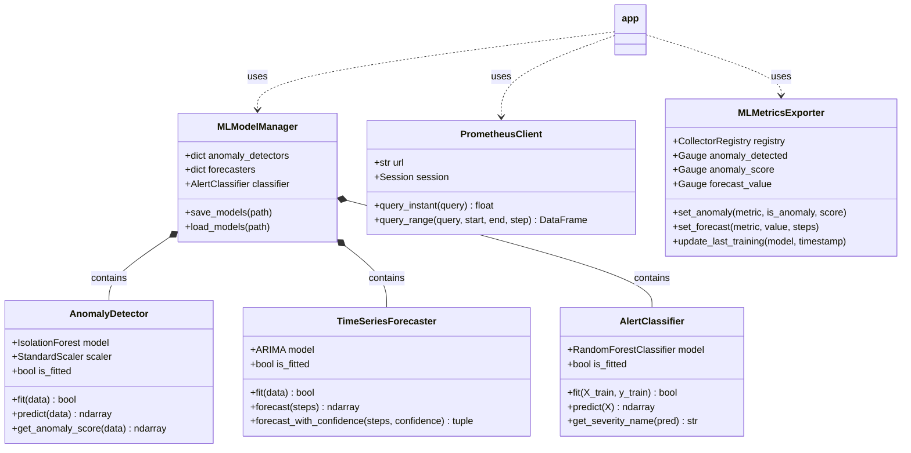

# Class Diagram

This diagram show the structure and relationships of the classes within the AIOps ML service.

```mermaid
classDiagram
    class MLModelManager {
        +dict anomaly_detectors
        +dict forecasters
        +AlertClassifier classifier
        +save_models(path)
        +load_models(path)
    }

    class AnomalyDetector {
        +IsolationForest model
        +StandardScaler scaler
        +bool is_fitted
        +fit(data) bool
        +predict(data) ndarray
        +get_anomaly_score(data) ndarray
    }

    class TimeSeriesForecaster {
        +ARIMA model
        +bool is_fitted
        +fit(data) bool
        +forecast(steps) ndarray
        +forecast_with_confidence(steps, confidence) tuple
    }

    class AlertClassifier {
        +RandomForestClassifier model
        +bool is_fitted
        +fit(X_train, y_train) bool
        +predict(X) ndarray
        +get_severity_name(pred) str
    }

    class PrometheusClient {
        +str url
        +Session session
        +query_instant(query) float
        +query_range(query, start, end, step) DataFrame
    }

    class MLMetricsExporter {
        +CollectorRegistry registry
        +Gauge anomaly_detected
        +Gauge anomaly_score
        +Gauge forecast_value
        +set_anomaly(metric, is_anomaly, score)
        +set_forecast(metric, value, steps)
        +update_last_training(model, timestamp)
    }

    MLModelManager *-- AnomalyDetector : contains
    MLModelManager *-- TimeSeriesForecaster : contains
    MLModelManager *-- AlertClassifier : contains
    
    app ..> MLModelManager : uses
    app ..> PrometheusClient : uses
    app ..> MLMetricsExporter : uses
```
