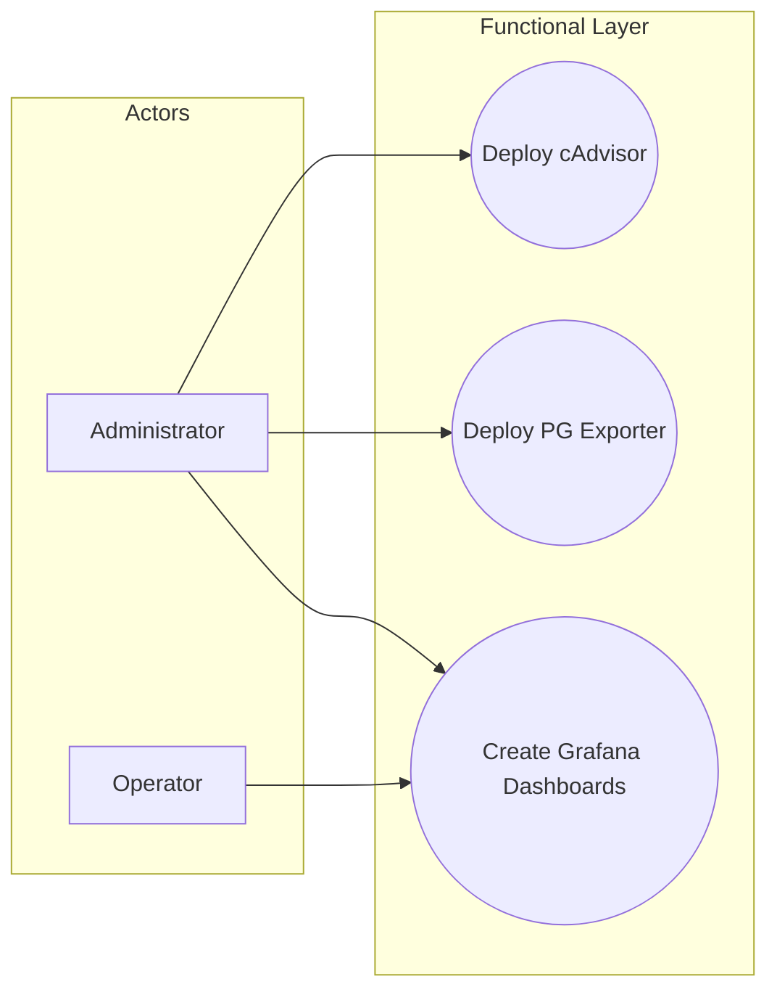
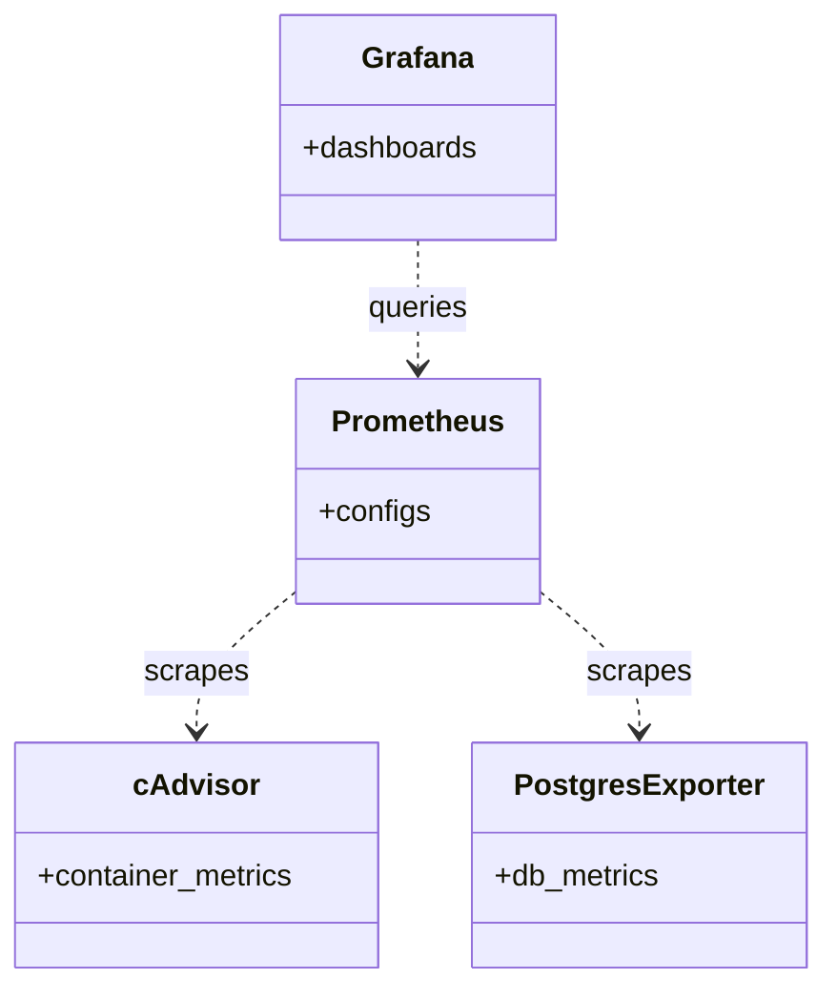
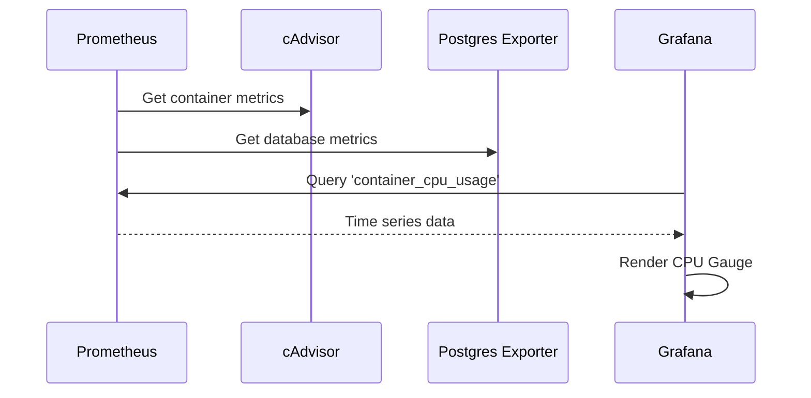

# Sprint 2: Use Case Diagram
## Goal: Expand collection and set up visualization.

```mermaid
graph LR
    subgraph Actors
        Admin["Administrator"]
        Op["Operator"]
    end

    subgraph "Functional Layer"
        UC021(("Deploy cAdvisor"))
        UC022(("Deploy PG Exporter"))
        UC023(("Create Grafana Dashboards"))
    end

    Admin --> UC021
    Admin --> UC022
    Admin --> UC023
    Op --> UC023
```
---
# Sprint 2: Class Diagram

```mermaid
classDiagram
    class Prometheus {
        +configs
    }
    class Grafana {
        +dashboards
    }
    class cAdvisor {
        +container_metrics
    }
    class PostgresExporter {
        +db_metrics
    }
    Prometheus ..> cAdvisor : scrapes
    Prometheus ..> PostgresExporter : scrapes
    Grafana ..> Prometheus : queries
```
---
# Sprint 2: Sequence Diagram

```mermaid
sequenceDiagram
    participant Prom as Prometheus
    participant CAD as cAdvisor
    participant PG as Postgres Exporter
    participant Graf as Grafana

    Prom ->> CAD: Get container metrics
    Prom ->> PG: Get database metrics
    Graf ->> Prom: Query 'container_cpu_usage'
    Prom -->> Graf: Time series data
    Graf ->> Graf: Render CPU Gauge
```
