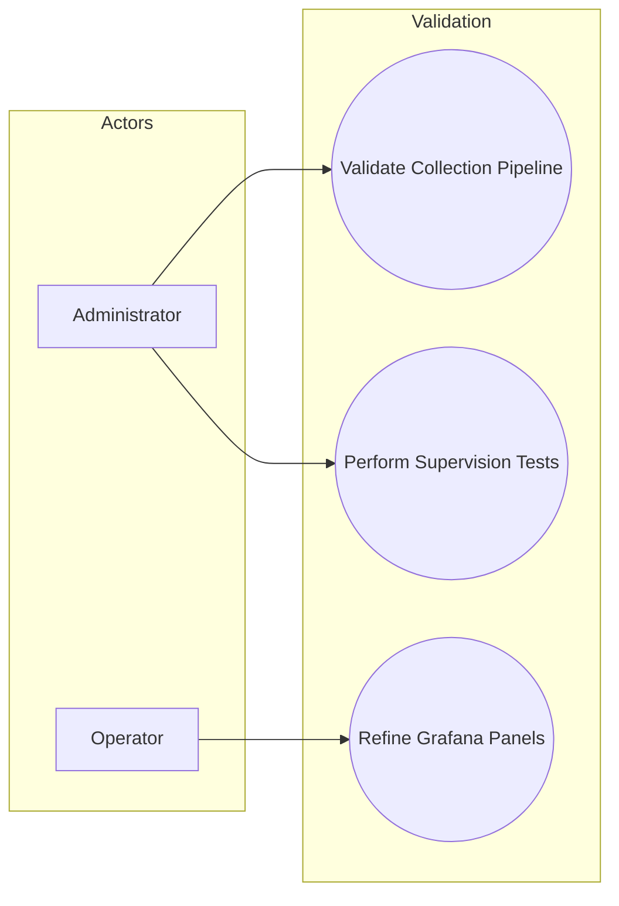

# Sprint 3: Use Case Diagram
## Goal: Pipeline Validation and Dashboard Refinement.

```mermaid
graph LR
    subgraph Actors
        Admin["Administrator"]
        Op["Operator"]
    end

    subgraph "Validation"
        UC031(("Validate Collection Pipeline"))
        UC032(("Perform Supervision Tests"))
        UC033(("Refine Grafana Panels"))
    end

    Admin --> UC031
    Admin --> UC032
    Op --> UC033
```
