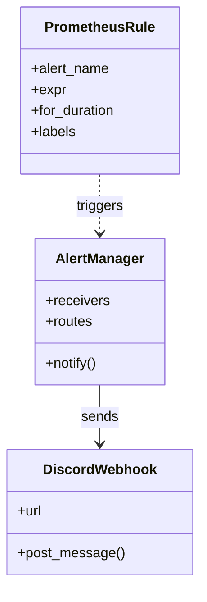

# Sprint 4: Class Diagram

```mermaid
classDiagram
    class AlertManager {
        +receivers
        +routes
        +notify()
    }
    class PrometheusRule {
        +alert_name
        +expr
        +for_duration
        +labels
    }
    class DiscordWebhook {
        +url
        +post_message()
    }

    PrometheusRule ..> AlertManager : triggers
    AlertManager --> DiscordWebhook : sends
```
