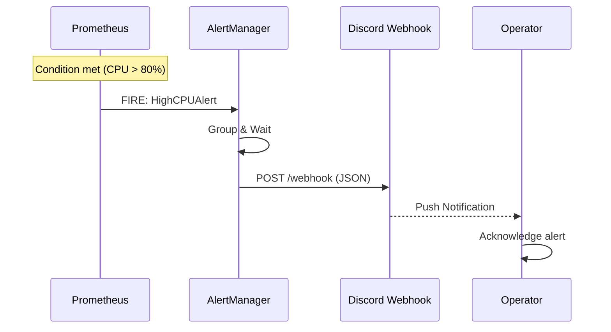

# Sprint 4: Sequence Diagram (Alerting Flow)

```mermaid
sequenceDiagram
    participant Prom as Prometheus
    participant AM as AlertManager
    participant Disc as Discord Webhook
    participant Op as Operator

    Note over Prom: Condition met (CPU > 80%)
    Prom ->> AM: FIRE: HighCPUAlert
    AM ->> AM: Group & Wait
    AM ->> Disc: POST /webhook (JSON)
    Disc -->> Op: Push Notification
    Op ->> Op: Acknowledge alert
```
