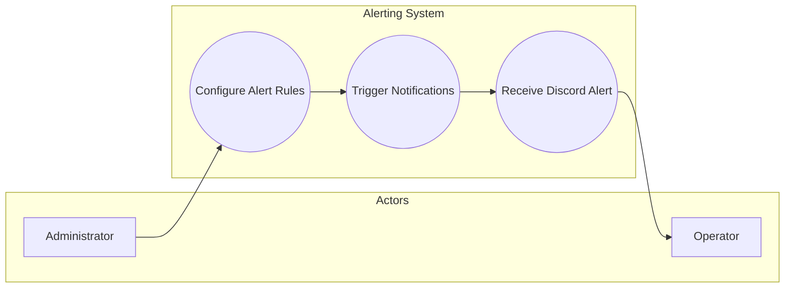

# Sprint 4: Use Case Diagram
## Goal: Implement Alerting and Notifications.

```mermaid
graph LR
    subgraph Actors
        Admin["Administrator"]
        Op["Operator"]
    end

    subgraph "Alerting System"
        UC041(("Configure Alert Rules"))
        UC042(("Trigger Notifications"))
        UC043(("Receive Discord Alert"))
    end

    Admin --> UC041
    UC041 --> UC042
    UC042 --> UC043
    UC043 --> Op
```
