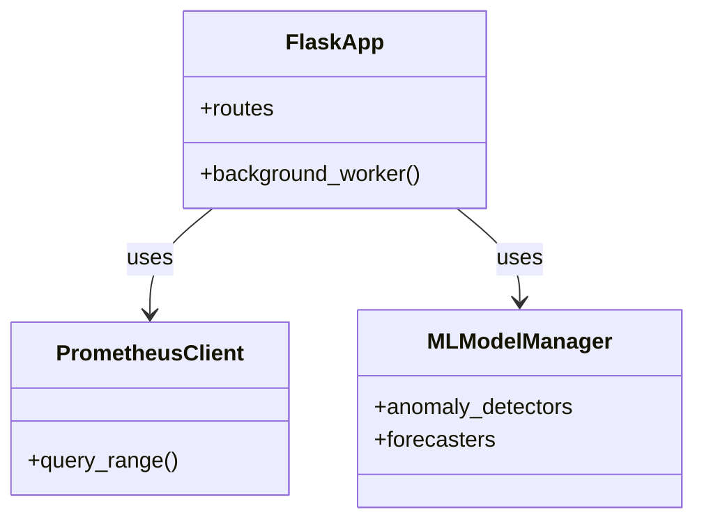

# Sprint 5: Class Diagram
## Goal: ML Service Architecture.

```mermaid
classDiagram
    class FlaskApp {
        +routes
        +background_worker()
    }
    class PrometheusClient {
        +query_range()
    }
    class MLModelManager {
        +anomaly_detectors
        +forecasters
    }
    FlaskApp --> PrometheusClient : uses
    FlaskApp --> MLModelManager : uses
```
