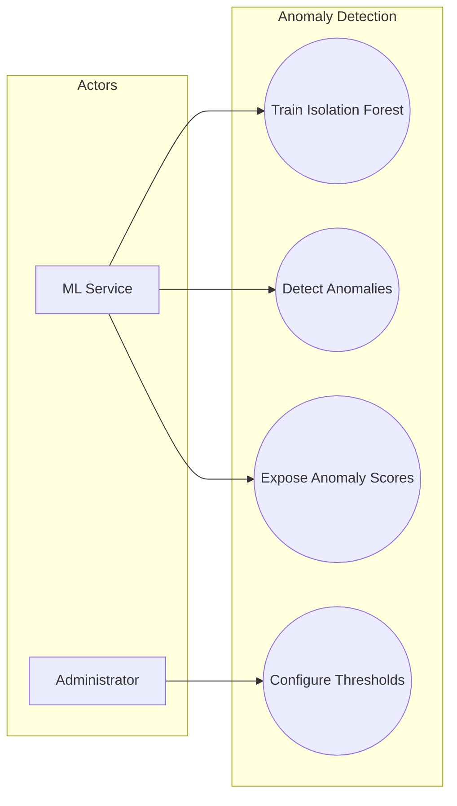

# Sprint 6: Use Case Diagram
## Goal: Implement Isolation Forest Anomaly Detection.

```mermaid
graph LR
    subgraph Actors
        ML["ML Service"]
        Admin["Administrator"]
    end

    subgraph "Anomaly Detection"
        UC061(("Train Isolation Forest"))
        UC062(("Detect Anomalies"))
        UC063(("Expose Anomaly Scores"))
        UC064(("Configure Thresholds"))
    end

    Admin --> UC064
    ML --> UC061
    ML --> UC062
    ML --> UC063
```
