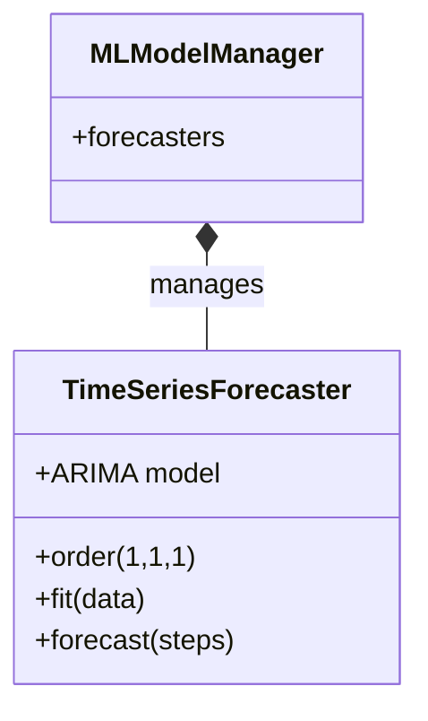

# Sprint 7: Class Diagram

```mermaid
classDiagram
    class TimeSeriesForecaster {
        +ARIMA model
        +order (1,1,1)
        +fit(data)
        +forecast(steps)
    }
    class MLModelManager {
        +forecasters
    }
    MLModelManager *-- TimeSeriesForecaster : manages
```
