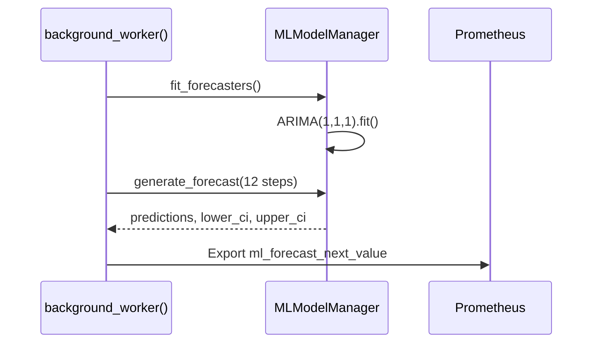

# Sprint 7: Sequence Diagram (Forecasting Flow)

```mermaid
sequenceDiagram
    participant Worker as background_worker()
    participant ML as MLModelManager
    participant Prom as Prometheus

    Worker ->> ML: fit_forecasters()
    ML ->> ML: ARIMA(1,1,1).fit()
    Worker ->> ML: generate_forecast(12 steps)
    ML -->> Worker: predictions, lower_ci, upper_ci
    Worker ->> Prom: Export ml_forecast_next_value
```
