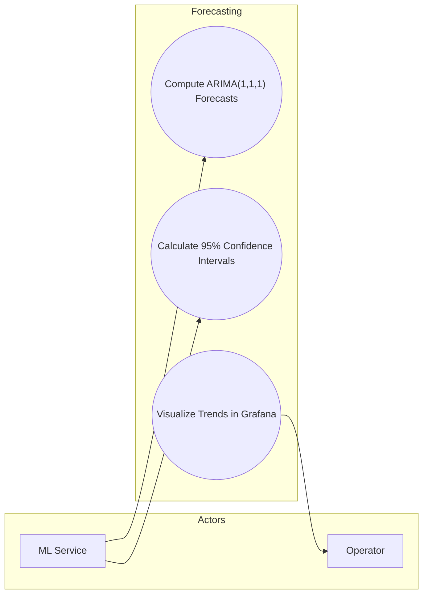

# Sprint 7: Use Case Diagram
## Goal: Implement Time Series Forecasting with ARIMA.

```mermaid
graph LR
    subgraph Actors
        ML["ML Service"]
        Op["Operator"]
    end

    subgraph "Forecasting"
        UC071(("Compute ARIMA(1,1,1) Forecasts"))
        UC072(("Calculate 95% Confidence Intervals"))
        UC073(("Visualize Trends in Grafana"))
    end

    ML --> UC071
    ML --> UC072
    UC073 --> Op
```
