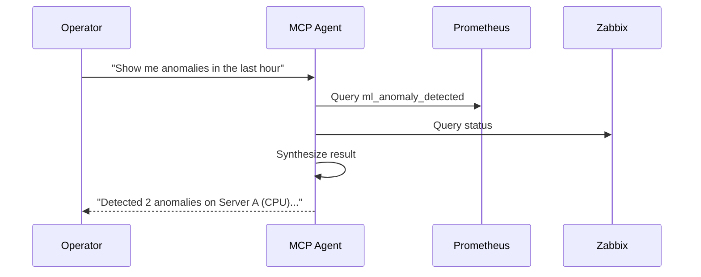

# Sprint 9: Sequence Diagram (AI Query Flow)

```mermaid
sequenceDiagram
    participant Op as Operator
    participant MCP as MCP Agent
    participant Prom as Prometheus
    participant Zab as Zabbix

    Op ->> MCP: "Show me anomalies in the last hour"
    MCP ->> Prom: Query ml_anomaly_detected
    MCP ->> Zab: Query status
    MCP ->> MCP: Synthesize result
    MCP -->> Op: "Detected 2 anomalies on Server A (CPU)..."
```
