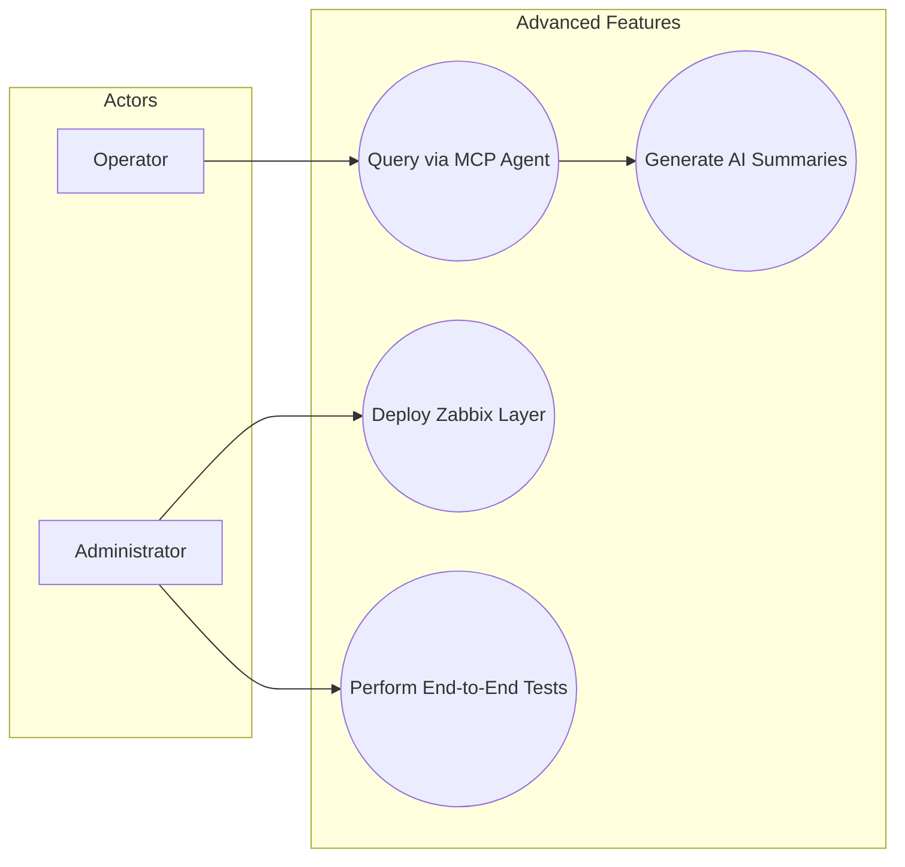

# Sprint 9: Use Case Diagram
## Goal: Zabbix Deployment and MCP Agent Integration.

```mermaid
graph LR
    subgraph Actors
        Op["Operator"]
        Admin["Administrator"]
    end

    subgraph "Advanced Features"
        UC091(("Deploy Zabbix Layer"))
        UC092(("Query via MCP Agent"))
        UC093(("Generate AI Summaries"))
        UC094(("Perform End-to-End Tests"))
    end

    Admin --> UC091
    Op --> UC092
    UC092 --> UC093
    Admin --> UC094
```
